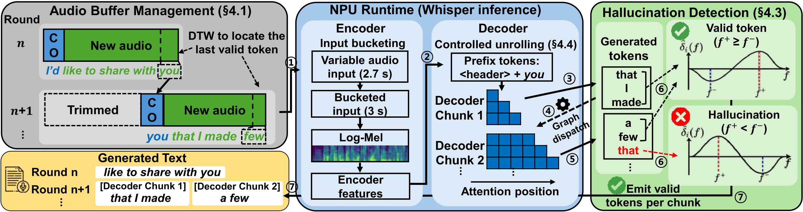

# NPUsper: Eliminating Redundant Computation for Real-Time Whisper on Mobile NPUs

## Demo

<video src="https://github.com/user-attachments/assets/d1a675ec-14e9-49e9-81b2-159ff8c9401d" controls width="100%"></video>

## Overview



We present NPUsper, a live transcription system that makes Whisper efficient on mobile NPUs by eliminating redundant computation. To avoid the heavy padding used by prior streaming systems, NPUsper detects hallucinated tokens online from temporal patterns in decoder cross-attention, allowing each inference round to process short audio inputs with minimal carryover. For efficient mobile-NPU execution, we propose controlled unrolling, which executes autoregressive decoding as K-step chunk graphs, removing unnecessary KV-cache computation and reducing graph-dispatch overhead. NPUsper achieves up to 4.84× lower per-word latency, up to 33.2× lower time-to-first-token (TTFT), and up to 88.64% lower average power consumption compared with baselines, while maintaining comparable transcription accuracy.

## Repository Structure

```
live-transcription/
  whisper-ggml/    # GGML-based inference (whisper.cpp)
  whisper-onnx/    # ONNX Runtime-based inference
```

---

## whisper-ggml

### Streaming Systems

| Binary | System |
|--------|--------|
| `whisper_streaming_cpp` | Whisper-Streaming |
| `whisper_streaming_cpp_optimized` | WhisperFlow |
| `simul_streaming` | SimulStreaming (AlignAtt) |
| `simul_whisper` | Simul-Whisper (AlignAtt + CIF) |
| `ours_streaming` | Ours |

### Prerequisites

- CMake >= 3.14
- C++17 compiler
- CUDA toolkit (for NVIDIA GPU build)
- Python 3 with `numpy`, `soundfile`, `jiwer` (for evaluation)

### Clone

```bash
cd live-transcription/whisper-ggml

# Initialize vendor/ggml submodule
git submodule update --init vendor/ggml
```

### Models

```bash
cd whisper-ggml

# Whisper ggml model
bash models/download-ggml-model.sh base
# Available: tiny, base, small, medium

# CIF model (SimulWhisper only) — already included at models/cif_base.bin
```

### Build

Build output goes to `build/<target>/bin/`.

#### Linux (CUDA)

```bash
cd whisper-ggml
cmake -S . -B build/linux -DCMAKE_BUILD_TYPE=Release -DWHISPER_CUDA=ON
cmake --build build/linux -j$(nproc)
```

> **Note**: Use `-DWHISPER_CUDA=ON`, not `-DGGML_CUDA=ON`.
> `WHISPER_CUDA=ON` internally sets `GGML_CUDA=ON`.

#### CPU-only

```bash
cmake -S . -B build/linux -DCMAKE_BUILD_TYPE=Release
cmake --build build/linux -j$(nproc)
```

#### Rebuild a single binary (after code change)

```bash
cmake --build build/linux --target ours_streaming -j$(nproc)
```

#### Verify GPU is enabled

Check `build/linux/CMakeCache.txt`:
```
WHISPER_CUDA:BOOL=ON
GGML_CUDA:BOOL=ON
```
Or run any binary and confirm the output contains `use gpu    = 1`.

### Evaluation

Run from the `whisper-ggml/eval/` directory.

```bash
cd whisper-ggml/eval

python run_streaming_comparison.py \
  --model base \
  --num_samples 10 \
  --step 2000 \
  --no-realtime \
  --bin-dir build/linux/bin \
  --whisper-streaming \
  --whisperflow \
  --simul-streaming \
  --simul-whisper \
  --ours-streaming \
  --ours-carryover-mode 3
```

#### Key flags

| Flag | Description |
|------|-------------|
| `--model` | `tiny`, `base`, `small`, `medium` |
| `--num_samples` | Number of LibriSpeech samples to evaluate |
| `--step` | Chunk size in ms (e.g. `2000`) |
| `--no-realtime` | Skip real-time sleep (faster simulation) |
| `--bin-dir` | Path to built binaries (relative to `whisper-ggml/`) |
| `--whisper-streaming` | Enable Whisper-Streaming |
| `--whisperflow` | Enable WhisperFlow |
| `--simul-streaming` | Enable SimulStreaming |
| `--simul-whisper` | Enable SimulWhisper |
| `--ours-streaming` | Enable Ours |
| `--ours-carryover-mode` | default: `3` |
| `--ours-word-end-offset` | Carryover offset in sec (default `-0.2`) |
| `--dataset` | `tedlium` |
| `--talk-index` | TED-LIUM talk index (default `0`) |

Results are saved to `whisper-ggml/eval/comparison_results/comparison_<datetime>_<model>_<N>samples_step<step>/`.

---

## whisper-onnx

ONNX Runtime backend for NPU acceleration. Currently only `ours_streaming` is built.

### Prerequisites

- CMake >= 3.17
- C++17 compiler
- ONNX Runtime (x86_64-gpu for Linux desktop, or cross-compiled for target devices)
- Python 3 with `torch`, `whisper`, `onnx`, `onnxruntime`, `numpy`, `soundfile`, `jiwer` (for export & evaluation)

### ONNX Runtime Setup

Download the pre-built ONNX Runtime matching your platform:

```bash
# Linux x86_64 (GPU, for desktop testing)
cd ~
wget https://github.com/microsoft/onnxruntime/releases/download/v1.23.0/onnxruntime-linux-x64-gpu-1.23.0.tgz
tar xzf onnxruntime-linux-x64-gpu-1.23.0.tgz
```

> **Note**: The downloaded ORT uses flat includes (`include/onnxruntime_cxx_api.h`).
> `whisper_ort.cpp` includes `<onnxruntime_cxx_api.h>` to match this layout.
> For cross-compiled ORT with nested includes (`onnxruntime/core/session/...`), adjust `ORT_INCLUDE_DIR` accordingly.

### Model Export

ONNX models are exported from PyTorch Whisper using `models/export_whisper_onnx.py`.

```bash
cd whisper-onnx/models

# fp32 (default)
python export_whisper_onnx.py --model base --output ./base

# fp16 (to match ggml fp16 weights)
python export_whisper_onnx.py --model base --output ./base_fp16 --fp16
```

This creates:
```
whisper-onnx/models/base/       (or base_fp16/)
  encoder.onnx
  decoder_prefill.onnx
  decoder_step.onnx
  vocab.txt
  dims.txt
```

`--fp16` exports in fp32 first, then converts weights to fp16 at ONNX level (I/O stays fp32 so C++ code needs no changes). Requires `onnxruntime` with `onnxruntime.transformers.float16`.

### Build

Build output goes to `build/<target>/bin/` (same layout as whisper-ggml).

#### Linux (desktop, GPU/CPU testing)

```bash
cd whisper-onnx

cmake -S . -B build/linux \
  -DCMAKE_BUILD_TYPE=Release \
  -DORT_ROOT=~/onnxruntime-linux-x64-gpu-1.23.0

cmake --build build/linux -j$(nproc)
```

Binary is at: `build/linux/bin/ours_streaming`

#### Rebuild a single binary (after code change)

```bash
cmake --build build/linux --target ours_streaming -j$(nproc)
```

### Evaluation

Run from the `whisper-onnx/eval/` directory.

```bash
cd whisper-onnx/eval

# fp16 model
python run_streaming_comparison.py \
  --model base_fp16 \
  --num_samples 100 \
  --step 2000 \
  --no-realtime \
  --no_gpu \
  --ours-streaming \
  --ours-carryover-mode 3 \
  --bin-dir build/linux/bin

# TED-LIUM (long-form)
python run_streaming_comparison.py \
  --model base \
  --step 2000 \
  --no-realtime \
  --no_gpu \
  --dataset tedlium \
  --talk-index 0 \
  --ours-streaming \
  --ours-carryover-mode 3 \
  --bin-dir build/linux/bin

```

> **Note**: `--no_gpu` is needed if ORT CUDA provider doesn't support the current GPU (e.g., RTX 5090 / sm_120).
> Omit `--no_gpu` when CUDA is compatible or on target devices with proper EP.

#### Key flags

| Flag | Description |
|------|-------------|
| `--model` | Model name (matches `models/<name>/` directory, e.g. `base`, `base_fp16`) |
| `--no_gpu` | Force CPU execution (bypass CUDA) |
| `--bin-dir` | Path to built binaries (relative to `whisper-onnx/`) |
| `--dataset` | `tedlium` (default: auto) |
| `--talk-index` | TED-LIUM talk index (default `0`) |
| `--ours-carryover-mode` | default: `3` |
| `--ours-word-end-offset` | Carryover offset in sec (default `-0.2`) |

Results are saved to `whisper-onnx/eval/comparison_results/comparison_<datetime>_<model>_<N>samples_step<step>/`.
